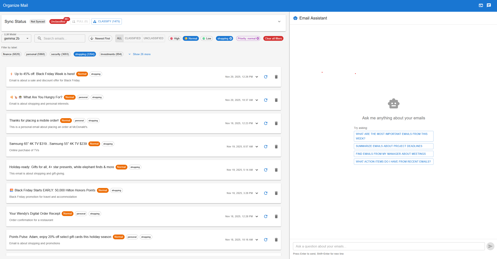

# organize-mail

AI-powered email organization system with intelligent classification, RAG-powered chat, and multi-provider LLM support.

## Overview

Organize Mail is a full-stack application that helps you manage your inbox intelligently. It uses AI to automatically classify emails, provides a conversational interface to search through your email history, and offers real-time monitoring of classification activities.

<!-- TODO: Add demo.gif or screenshot here -->

*Application demo showing email classification and chat interface*

## Key Features

- **Intelligent Email Classification**: Automatically categorize emails by type (finance, security, meetings, etc.) and priority
- **RAG-Powered Chat**: Ask questions about your email history using retrieval-augmented generation
- **Real-Time Logging**: WebSocket-based log viewer for monitoring system activity
- **Multi-Provider LLM Support**: Choose from OpenAI, Anthropic, Ollama (local), custom commands, or rule-based classification
- **Gmail Integration**: Pull messages via Gmail API with batch sync (OAuth + refresh token)
- **Flexible Storage**: SQLite or PostgreSQL backend with classification history and audit trails
- **REST API**: FastAPI backend with comprehensive endpoints for messages, classifications, and RAG queries
- **Modern Frontend**: React + TypeScript UI with Material-UI components, resizable panels, and real-time updates

## Project Structure

```
organize-mail/
├── backend/                 # Python FastAPI backend
│   ├── src/
│   │   ├── api.py          # REST API endpoints
│   │   ├── llm_processor.py # Multi-provider LLM system
│   │   ├── clients/        # Gmail API client
│   │   ├── jobs/           # Background jobs (classification, sync)
│   │   ├── models/         # Data models (Message, ClassificationRecord)
│   │   └── storage/        # Storage layer (SQLite, PostgreSQL)
│   ├── tests/              # Pytest test suite
│   └── examples/           # LLM provider examples & docs
├── frontend/               # React + TypeScript UI
│   ├── src/
│   │   ├── components/     # React components (EmailList, etc.)
│   │   └── types/          # TypeScript type definitions
│   └── tests/              # Vitest test suite
├── llm/                    # Local LLM deployment (Ollama configs)
└── docs/                   # Architecture & runbooks
```

## Quick Start

1. **Backend Setup**
   ```bash
   cd backend
   python -m venv .venv
   source .venv/bin/activate
   pip install -r requirements.txt
   uvicorn src.api:app --reload
   ```

2. **Frontend Setup**
   ```bash
   cd frontend
   npm install
   npm run dev
   ```

3. **Configure Gmail Integration**
   - Set up OAuth credentials in Google Cloud Console
   - Generate refresh token (currently using Google OAuth Playground)
   - Set environment variables: `GMAIL_USER_EMAIL`, `GMAIL_REFRESH_TOKEN`

See [Backend README](backend/README.md) and [Frontend README](frontend/README.md) for detailed setup instructions.

## TODO

- [ ] **OAuth Integration with Pub/Sub**: Migrate from batch sync (using refresh token from Google OAuth Playground) to proper OAuth flow with Gmail Pub/Sub webhooks for real-time email notifications

## Documentation

- [Backend README](backend/README.md) - API, jobs, storage, and RAG details
- [Frontend README](frontend/README.md) - UI components, logging, and development
- [LLM Examples](backend/examples/README.md) - Provider setup and usage
- [Quick Reference](backend/examples/QUICKSTART.md) - One-line setup commands
- [8GB Setup Guide](backend/examples/SETUP_8GB.md) - Optimized for small VMs
- [PostgreSQL Setup](POSTGRES_SETUP.md) - PostgreSQL storage configuration
- [Architecture](docs/architecture.md) - System design and data flow
- [RAG Documentation](docs/RAG_DOC.md) - Retrieval-augmented generation system
- [Storage Schema](docs/STORAGE_SCHEMA.md) - Database schema and migrations

## License

See [LICENSE](LICENSE)
